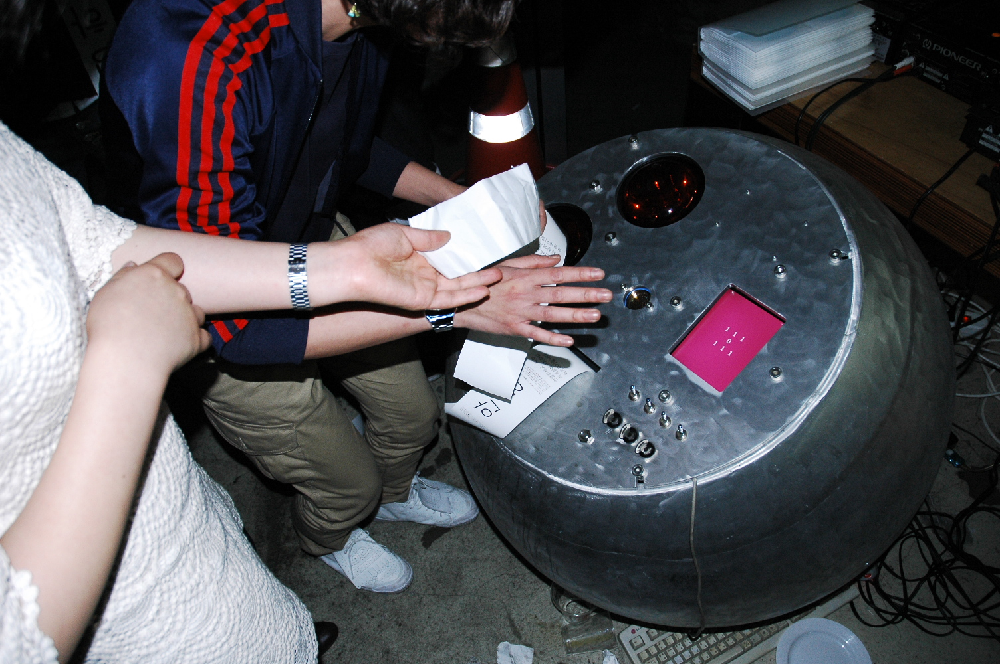

## Overview
A series of attempts to build an indestructible weapon that does NOT attack. The first version, Weapons of Mass Happiness, was a heavy cast-aluminum sphere with a Geiger counter and a printer that outputs messages when triggered by nuclear explosion. 

